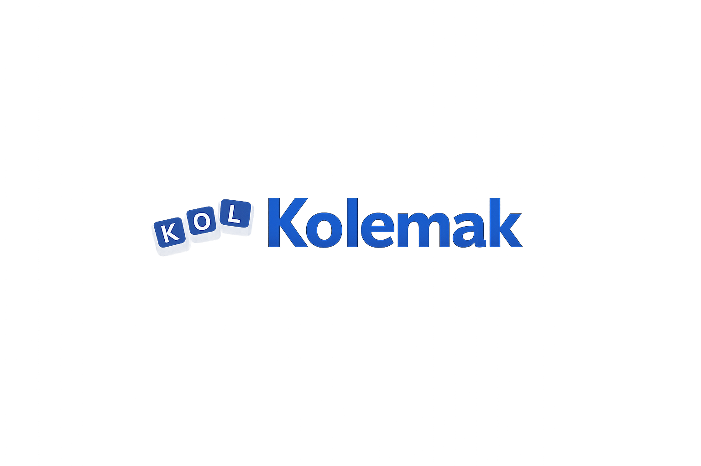

# Kolemak

A Colemak keyboard layout driver for Windows with native Korean (Dubeolsik) IME support. Switch between Colemak and QWERTY instantly with a single hotkey — no OS-level layout changes required.

Windows에서 두벌식 한글 입력을 지원하는 Colemak 자판 드라이버입니다. 별도의 OS 설정 변경 없이 단축키 하나로 Colemak과 QWERTY를 즉시 전환할 수 있습니다.

## Documentation

[English](./docs/en.md) | [한국어](./docs/ko.md)

## License

[GNU General Public License v3.0](./LICENSE)