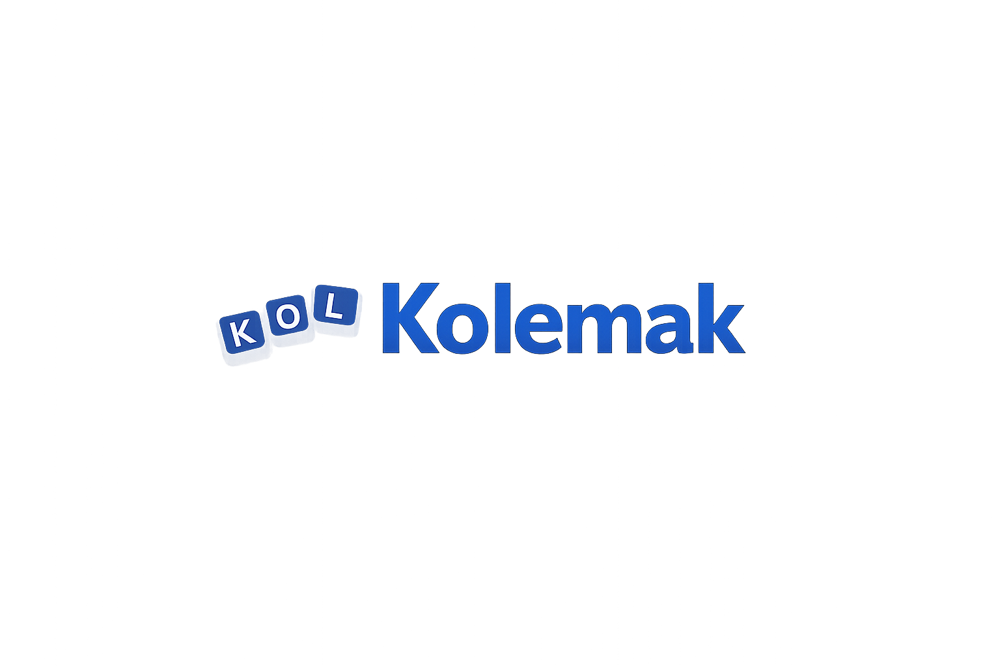

# Kolemak

A native Windows IME that provides Colemak keyboard layout with Korean Dubeolsik input support. Built on Windows TSF (Text Services Framework), aiming to work as reliably as the default Windows Korean IME across all applications.

Windows TSF 기반의 네이티브 입력기로, Colemak 자판 배열과 두벌식 한글 입력을 지원합니다. 모든 애플리케이션에서 안정적으로 동작하는 Windows 기본 한글 입력기와 동등한 수준의 호환성을 목표로 합니다.

## Documentation

[English](./docs/en/guide.md) | [한국어](./docs/ko/guide.md)

## Build Guide

[English](./docs/en/build.md) | [한국어](./docs/ko/build.md)

## License

[GNU General Public License v3.0](./LICENSE)
